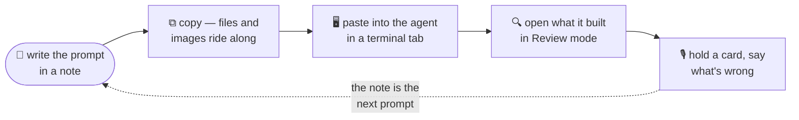

<div align="center">


# MD Notepad

**A markdown notepad that grew into a workbench for building software with AI — no syntax required.**

*Write the prompt. Run the agent beside it. Read what it built in plain English. Tell it what to change next, out loud.*

[](https://github.com/l-small-tech/md-notepad/releases)
[](LICENSE)
[](https://github.com/l-small-tech/md-notepad/releases)

[](https://tauri.app)
[](https://www.rust-lang.org)
[](https://react.dev)
[](https://www.typescriptlang.org)
[](https://vite.dev)
[](https://codemirror.net)
[](https://milkdown.dev)
[](https://mermaid.js.org)

[Install](#install) · [The loop](#the-loop) · [Write](#write) · [Run](#run) · [Review](#review) · [Docs](docs/README.md) · [Build from source](#build-from-source)

</div>

---

## Why

Coding agents like [Claude Code](https://claude.com/claude-code) let anyone
build software by describing it. But the tools around them still assume you
can read code: the prompt lives in a chat box, the agent runs in a bare
terminal, and the result is a folder of `.ts` files you can't judge.

MD Notepad closes that gap. It started as a Windows-Notepad-style markdown
app — open a tab, type, close the app, it's all there next time — and that
core is still what makes it good for the two things you do most with an
agent: **writing prompts** and **reading what comes back**. Around it grew
the rest of the loop: terminals that run the agent next to your notes, a
**Review** mode that shows a code file's structure as plain-English cards,
and **voice notes** that turn your reaction into the next prompt.

The point is a gentle slope. A first-timer can build something real without
learning a shell or a language. Every step of the way the app shows the
real command it typed, the real signature under the plain sentence, the real
file on disk — so the concepts arrive one at a time, and the app keeps up
when you've learned them.

## The loop



Everything in the diagram is markdown, files on disk, or a real terminal.
Nothing is trapped in the app.

## Write

The notepad half. Fast, plain, and built to never lose a word.

- 🗂️ **Tabs you never have to save.** Unsaved notes persist across restarts
  and name themselves after their first line. Chrome-style **tab groups**
  keep a project's tabs together. Kill the app any time and lose at most a
  few seconds of typing.
- 📄 **Notes are plain `.md` files** in a folder you choose — no database,
  no lock-in. Open and save regular files anywhere, too.
- 👁️ **Four modes per tab** — raw source (CodeMirror 6), split
  source+preview, WYSIWYG (Milkdown Crepe), and a distraction-free **Review**
  mode with zoom. Any mode goes distraction-free (chrome hidden) or full
  screen (F11), independently.
- 🧜 **Full GFM preview** — tables, task lists, strikethrough, autolinks —
  plus **Mermaid** diagrams rendered in place. Ask an agent for a diagram
  and read it here.
- 🗄️ **Workspaces** — add any folder as a sidebar section with its own
  accent color. Add a repo's `docs/` folder read-only and read what the
  agent wrote, rendered, without leaving your notes.
- 🤝 **Live edit** — mark a shared folder and every file in it merges other
  people's (or agents') changes as they land. When the disk wins a
  collision it flashes red and offers *Restore mine*.
- 🖼️ **Painless images** — paste a screenshot and it's saved beside your
  note and referenced at the caret; drag images in from anywhere.
- ✏️ **Drawing tabs** — a whiteboard in a tab, saved as a plain `.svg`.
  Point a camera at a real whiteboard and **scan** it into editable strokes,
  with OCR so the words are searchable.
- 🪟 **Multiple windows** — drag a tab out to open it in its own window, or
  drop it onto another window. Extra windows come back on restart.
- 🎨 **Fifteen built-in themes**, including maximum-contrast and
  color-vision-friendly pairs. Themes are tiny files; an **AI theme** button
  writes a new one from a description.
- 🔤 **Eight bundled open-source fonts**, Fira Code with ligatures by default.
- 📤 **Export to HTML or PDF**, themed to match, embedded SVGs recolored.

### Prompts that carry their context

- **Copy carries your attachments.** The ⧉ button — and plain **Ctrl+C** on
  a selection — copies markdown *plus* an appended block of `@path`
  mentions for every local file and image the text references. Paste into
  an agent and it pulls those files in directly. Build a prompt with
  screenshots and reference files, keep it in a note, ship it in one paste.
- **Absolute paths by default.** Inserted links and pasted images are
  referenced by absolute path, so an agent can resolve them wherever it was
  launched. Alt+click the link buttons for a relative path instead.

## Run

Terminal tabs (desktop) put the agent next to the prompt.

- 🖥️ **A real terminal in a tab**, split as many ways as you like, colored
  by whichever theme you use. Written from scratch — no xterm.js.
- 🤖 **Harness row.** The `+` menu launches your coding agent (Claude Code,
  Copilot, opencode…) in the current folder. The tab wears a status badge so
  you can see it thinking from another tab. Missing agents are detected and
  offered an **Install** button.
- 🧭 **The tab knows where it is.** Shell integration follows `cd`, so a
  terminal tab takes the color of the workspace its shell is standing in.
- 🖱️ **Right-click helpers that teach the shell.** *Change directory…*,
  *List files*, and *Open Claude* each **type an ordinary command at the
  prompt** and press Enter — nothing hidden, so you watch and learn it.
- 🎨 Light themes are tuned so agent TUIs stay readable.

## Review

Understanding code without reading the syntax. Open a `.ts`, `.tsx`, `.js`
or `.rs` file and press **Ctrl+4**. (More languages are planned; the model
is language-neutral and each one is a single extractor.)

- 🃏 **One card per declaration**, in source order. A function becomes a
  sentence: *"Takes a folder path, a list of folders, and an optional list
  of folders, and gives back* show *(yes or no) and* explicit *(yes or
  no)."* The real signature sits under it in code font, then the author's
  comment. Structs, interfaces, enums and classes become **forms** — a table
  of fields with plain-English types.
- 🩻 **X-ray fold.** *Code* on a card opens the body folded to its bones —
  declarations and the `if` / `for` / `match` / `return` lines — with
  `⋯ 9 lines` markers you tap to open one level at a time.
- 🔀 **Flow and Calls.** One function's branches as a flowchart; the whole
  file's who-calls-whom as a graph. Tap a node to jump to its card. Every
  diagram opens fullscreen with pinch-zoom.
- 🔍 **What changed.** Pick a baseline — *this branch*, *uncommitted*, or
  *last commit* — and cards carry **added / changed / removed** badges, with
  a changed signature explained ("now also takes hiddenDirs"). Needs `git`
  on the machine; without it every other view still works.
- 🎙️ **Voice notes on cards.** Press and hold a card and say what's wrong.
  The note lands in `<file>.<ext>.comments.md` beside the file, quoting the
  declaration and recording the branch and baseline — a prompt an agent can
  act on directly. Spoken names snap to the real identifiers; the offline
  Whisper engine is primed with the file's own names.

Voice notes work on markdown too: in Review mode, hold a line and dictate.
Notes never touch the document. Transcription is Windows voice typing on
Windows, offline **Whisper** on macOS and Linux (or Windows, if you choose),
and the native recognizer on Android. No audio is ever written to disk.

## Install

Prebuilt installers are on the
[Releases](https://github.com/l-small-tech/md-notepad/releases) page:
Windows (NSIS `.exe`), macOS (universal `.dmg`), Linux (`.deb`, `.rpm`,
`.AppImage`), and Android (`.apk`). Each release carries a short changelog of
what's new.

Because releases are not code-signed with paid OS certificates (yet):

- **Windows** SmartScreen: *More info → Run anyway* on first launch.
- **macOS** Gatekeeper: right-click the app → *Open* on first launch.

### Verifying a download

Every release ships `SHA256SUMS` and Sigstore build-provenance
attestations:

```sh
sha256sum -c SHA256SUMS --ignore-missing
gh attestation verify <asset-file> --repo l-small-tech/md-notepad
```

### Updates

The app checks GitHub Releases on launch, weekly, and on demand from
Settings. When a newer version exists, a quiet chip appears in the status
bar — one click downloads, installs, and restarts. Every update package is
verified against the minisign public key embedded in the app before it is
applied, and open tabs are flushed to disk first, so updating never costs
typed text. The check is silent on failure and never blocks startup.

## Where your notes live

| OS | Default notes folder |
| --- | --- |
| Windows | `%APPDATA%\tech.l-small.mdnotepad\notes` |
| macOS | `~/Library/Application Support/tech.l-small.mdnotepad/notes` |
| Linux | `~/.local/share/tech.l-small.mdnotepad/notes` |

Changeable in Settings. Notes are ordinary markdown files named after their
first line — take them with you any time. Closing a note tab discards that
note (you'll be asked first); saving it elsewhere via *Save As* turns it
into a regular file.

## Documentation

The full user guide lives in [`docs/`](docs/README.md) and ships inside the
app — Settings → **Open docs** adds it to the sidebar as a read-only
workspace. It is written for people who have never used markdown or a
terminal:

[Getting started](docs/getting-started.md) ·
[Notes, tabs & saving](docs/notes-tabs-and-saving.md) ·
[Viewing modes (incl. Review)](docs/editing-modes.md) ·
[Writing markdown](docs/writing-markdown.md) ·
[Workspaces](docs/workspaces-and-files.md) ·
[Images](docs/pictures-and-images.md) ·
[Settings (incl. voice notes & harness)](docs/settings.md) ·
[Themes](docs/themes.md) ·
[Terminal tabs](docs/terminal.md) ·
[Keyboard shortcuts](docs/keyboard-shortcuts.md)

## Known limitations

**Review mode** is a reading aid, not a specification. The plain-English
sentence is built from rules about parameter names and types; when it looks
off, trust the signature underneath. Review never edits code.

**Edit / WYSIWYG mode** is markdown-first, but a WYSIWYG editor rewrites
source the moment you edit. By design:

- **Viewing never changes a note.** Opening a note in Edit mode and switching
  back is byte-identical — nothing is written until you actually edit.
- **Your first edit normalizes syntax spelling** (list markers, emphasis
  characters, blank-line spacing may change). *Content is preserved*; only
  how the markdown is written may differ.
- **Mermaid diagrams show as plain code** in Edit mode (they still render in
  split/preview).
- **Undo history does not cross a raw ⇄ Edit switch.**

Prefer raw or split mode when you need byte-exact control over markdown.

## Tech stack

| Layer | Technology |
| --- | --- |
| Shell | [Tauri 2](https://tauri.app) (Rust backend, native WebView) |
| UI | [React 19](https://react.dev) + [TypeScript](https://www.typescriptlang.org) + [Zustand](https://zustand-demo.pmnd.rs) |
| Source editor | [CodeMirror 6](https://codemirror.net) |
| WYSIWYG editor | [Milkdown Crepe](https://milkdown.dev) |
| Markdown pipeline | [unified](https://unifiedjs.com) (remark-gfm → rehype-sanitize) |
| Diagrams | [Mermaid](https://mermaid.js.org) |
| Code review | [Lezer](https://lezer.codemirror.net) parsers (TypeScript, Rust) → language-neutral model → plain-English rules, call graph, flowcharts; `git` via the CLI for *What changed* |
| Voice | [whisper.cpp](https://github.com/ggerganov/whisper.cpp) via `whisper-rs` (offline, every platform; Vulkan / Metal on the GPU); Windows voice typing; Android SpeechRecognizer |
| Drawing | hand-written SVG whiteboard editor + camera-scan pipeline (raster clean-up → vectorized strokes → OCR) |
| Terminal | hand-written VT/xterm engine + canvas renderer (no xterm.js), [portable-pty](https://crates.io/crates/portable-pty) on the Rust side |
| Build / test | [Vite](https://vite.dev) + [Vitest](https://vitest.dev), cargo for the shell |
| Fonts | [Fira Code](https://github.com/tonsky/FiraCode) (default) + 6 more monospace faces and [Inter](https://rsms.me/inter/), all bundled via [@fontsource](https://fontsource.org) (OFL-1.1) |

## Build from source

Prerequisites: Node ≥ 20, [pnpm](https://pnpm.io) ≥ 10, Rust (stable, via
[rustup](https://rustup.rs)), CMake and LLVM/libclang (for the bundled
Whisper engine), plus per-OS Tauri deps — Windows: MSVC Build Tools +
WebView2 (in Windows 11); macOS: Xcode CLT; Linux: `libwebkit2gtk-4.1-dev
build-essential curl wget file libxdo-dev libssl-dev
libayatana-appindicator3-dev librsvg2-dev`.

Whisper runs on the GPU where it can — Vulkan on Windows and Linux, Metal
on macOS — and building that backend needs the shader compiler from the
[Vulkan SDK](https://vulkan.lunarg.com/sdk/home) (Windows: the installer,
which sets `VULKAN_SDK`; Linux: `libvulkan-dev glslc`). Users need nothing:
the app only wants the Vulkan loader that ships with any GPU driver, and on
Windows it is delay-loaded so a machine without one still starts and
transcribes on the CPU. **Windows, one more thing:** the shader generator
is a nested CMake project ~150 characters deep inside the target dir and
MSVC's build tooling still stops at MAX_PATH. The `pnpm run tauri*` scripts
go through `scripts/tauri-env.mjs`, which builds from a short
`C:\t\<hash>` target dir (one per checkout; even `%LOCALAPPDATA%` is too deep) and
fills in `VULKAN_SDK`, `LIBCLANG_PATH` and CMake's PATH entry when the
shell lacks them. Running `cargo` directly in `src-tauri` needs the same:
set `CARGO_TARGET_DIR` to something short and `VULKAN_SDK` yourself.

```sh
pnpm install
pnpm run tauri dev      # run the app (vite + cargo, hot reload)
pnpm run tauri:dev:verbose  # same, with app logging at DEBUG (MDN_LOG=trace for more)
pnpm run tauri build    # produce installers for your OS
```

Checks: `pnpm run check && pnpm test`, and in `src-tauri/`:
`cargo fmt --check && cargo clippy --all-targets -- -D warnings && cargo test`.

## Contributing / architecture

Start with [src/README.md](src/README.md) — it owns the frontend-wide rules.
Each source directory has a README specifying its architecture, contracts,
and invariants. [CLAUDE.md](CLAUDE.md) is the guide for coding agents
working in this repo, which is how most of it gets built.

## Releasing (maintainers)

Versions live in three files that must agree: `package.json`,
`src-tauri/tauri.conf.json`, `src-tauri/Cargo.toml`. Bump all three,
then:

1. **Write the changelog.** Rename the `## [Unreleased]` section of
   [CHANGELOG.md](CHANGELOG.md) to `## [X.Y.Z] — YYYY-MM-DD`. It is a
   short, high-level list of the major improvements — a paragraph a user
   would want to read, not an inventory of commits. `release.yml` copies it
   into the release notes and **fails the release if the section is
   missing.**
2. Tag `vX.Y.Z` and push the tag. `release.yml` builds every platform into
   a **draft** release with the changelog on top, the updater manifest
   (`latest.json`), minisign `.sig` files, `SHA256SUMS`, and Sigstore
   attestations.
3. Review the draft (install at least one asset), then publish; publishing
   is what makes `latest.json` visible to auto-updaters.

The updater key ceremony happened once at M7 (2026-07-10): a minisign
keypair was generated offline with `tauri signer generate`; the private
key + password live in the maintainer's password manager and in the repo's
Actions secrets (`TAURI_SIGNING_PRIVATE_KEY`,
`TAURI_SIGNING_PRIVATE_KEY_PASSWORD`); the public key is embedded in
`tauri.conf.json`. **Losing the private key or its password orphans the
update channel** — every installed copy would refuse updates signed by any
other key, and users would have to reinstall manually. Guard it.

## License

[GPL-3.0-only](LICENSE). Bundled third-party components are listed in
[THIRD-PARTY-NOTICES.txt](THIRD-PARTY-NOTICES.txt) (shipped with the app).
All bundled fonts (Fira Code, JetBrains Mono, Cascadia Code, Source Code
Pro, IBM Plex Mono, Inconsolata, Victor Mono, Inter) are © their respective
project authors, SIL Open Font License 1.1.
