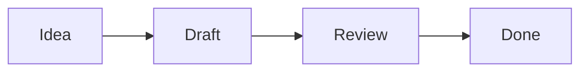

# Writing markdown

Markdown is plain text with a few extra symbols for formatting. You can
read it as-is, and MD Notepad turns it into clean, styled text in Split,
Rich, and Read modes.

The easiest way to learn: put a tab in **Split mode** (Ctrl+2) and copy the
examples below into it.

## The essentials

| Type this | To get |
| --- | --- |
| `# Big heading` | A top-level heading |
| `## Smaller heading` | A sub-heading (up to `######`) |
| `**bold**` | **bold** |
| `*italic*` | *italic* |
| `~~crossed out~~` | ~~crossed out~~ |
| `` `code` `` | `code` in a typewriter box |
| `[a link](https://example.com)` | a clickable link |

Leave a blank line between paragraphs — that's what starts a new one.

## Lists

```
- Milk
- Eggs
- Bread
```

Use `-` (or `*`) for bullets, `1.` `2.` `3.` for numbered lists, and indent
with two spaces for sub-items.

### Checklists

```
- [ ] Book flights
- [x] Renew passport
```

`[ ]` is an open box, `[x]` a checked one.

## Quotes, dividers, and code blocks

```
> A quoted line, like in an email reply.

---

    (three dashes above make a horizontal divider)
```

For a block of code or any text you want left exactly as typed, fence it
with three backticks:

````
```
This text keeps its    spacing
and line breaks.
```
````

## Tables

```
| Name  | Amount |
| ----- | ------ |
| Rent  | 900    |
| Food  | 250    |
```

The pipes don't have to line up perfectly — the preview tidies them.

## Diagrams (Mermaid)

MD Notepad can draw flowcharts and other diagrams from a text description,
using a popular format called Mermaid. Fence the description with
` ```mermaid `:

````

````

In Split and Read modes this appears as an actual diagram with boxes and
arrows. (In Rich mode it stays as text — that's expected.) Mermaid can do
much more — pie charts, timelines, sequence diagrams; searching the web for
"mermaid diagrams" will find a full guide.

## Formatting without memorizing

You don't have to remember any of this:

- The **toolbar** above the editor has buttons for bold, italic,
  strikethrough, code, headings, quotes, lists, and links. Select some text
  and click.
- The 📎 button inserts a link to another file on your computer; 🖼 inserts
  an image. Links use the file's full (absolute) path, so AI tools and other
  apps can always find the file. (Hold Alt while clicking to use a relative
  path instead — useful if the note and the file move around together.)
- In **Rich mode**, select text and a mini formatting toolbar appears right
  next to it.

## Copying your work elsewhere

The **⧉** button (top-right) copies the tab's entire raw markdown to the
clipboard, ready to paste into email, chat, or another app. If the note
links to local files or images, their locations are appended in a form the
Claude Code assistant understands (`@file` mentions).

**Ctrl+C** does the same for a selection: copy some text in the editor and
any files or images it links to are appended as `@file` mentions too — so
a prompt you copy out of a note arrives with its attachments listed.
