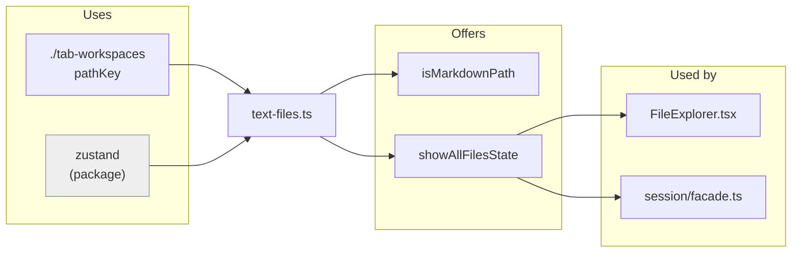
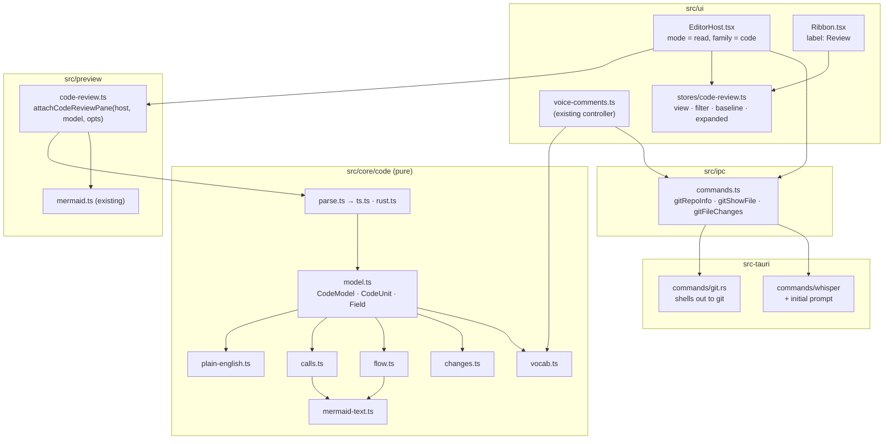
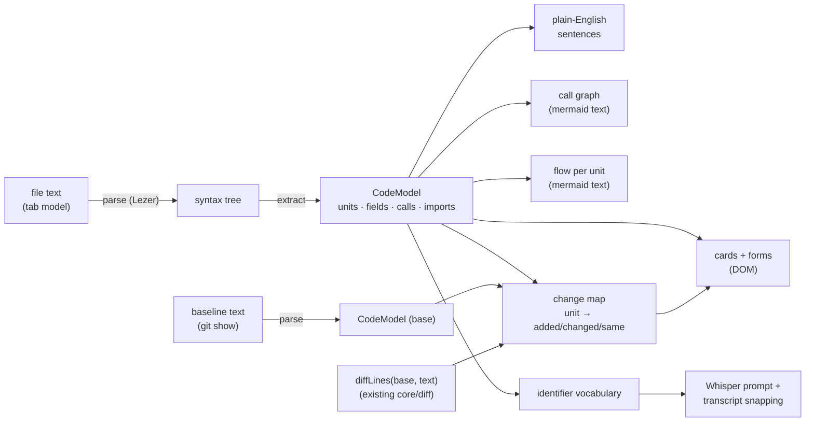
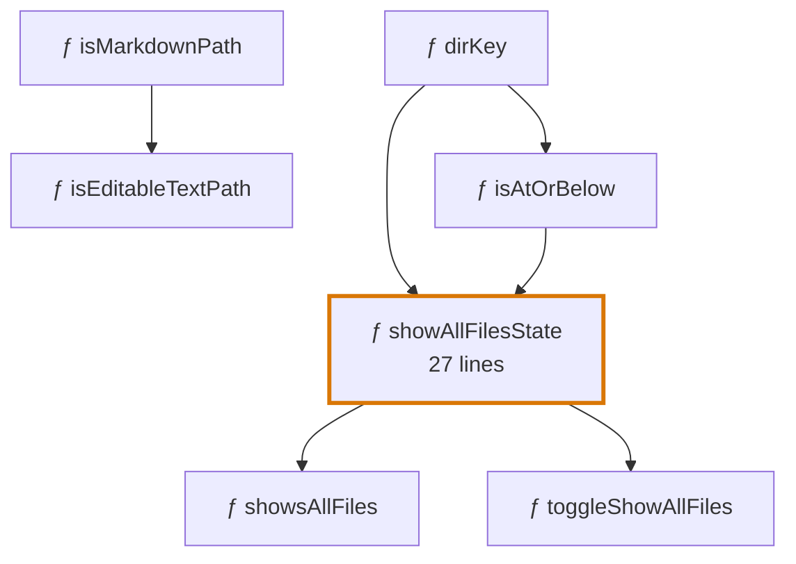
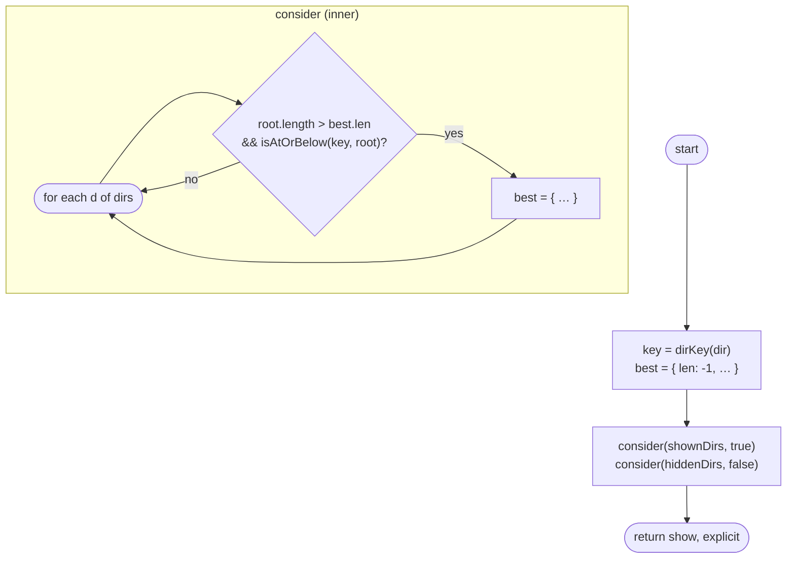
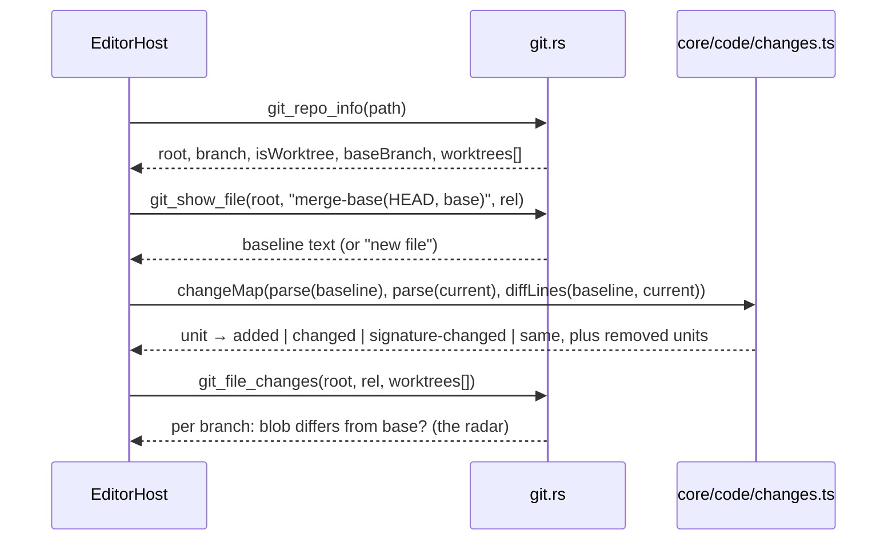
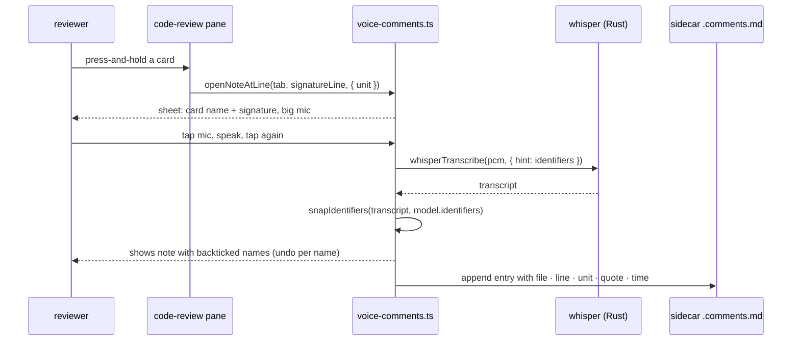

# Review mode for code files — implementation plan

Status: DONE (built 2026-09-11 on branch feat/code-review). Written 2026-09-10 for execution by Claude Code. Open this
file in md-notepad's Review mode: every diagram below is mermaid and renders
in the app.

## 0. What this is

A `.ts` or `.rs` file opened in the app today has one mode, Raw. This plan
gives the `code` document family a second mode, **Review**: a read-only,
touch-first rendering of the file's *structure* for a reader who understands
what code is but not the syntax. Nothing here edits code. The output of a
review session is voice notes in the existing `<name>.comments.md` sidecar,
which an agent then acts on.

Six views, all projections of one parsed model of the file:

| View | What the reader sees |
| --- | --- |
| Card deck | One card per declaration, in source order, doc comment as the body |
| Plain-English signatures | "Takes a folder path and two lists of folders, gives back yes or no" |
| Forms | Structs, interfaces, enums and classes as labeled tables |
| What changed | Cards badged added / changed / removed against a chosen baseline, worktree-aware |
| Call graph | Which functions in this file call which, as a diagram |
| Control flow | One function's branches and loops as a flowchart |

## 1. Decisions already made

- **Review reuses the existing `read` mode.** `CODE_MODES` becomes
  `['raw', 'read']`; the ribbon labels it *Review* for the code family and
  *Read* for markdown. No new `EditorMode` value, so session manifests, the
  mode picker, mod+4 and `isModeAllowed` all work unchanged.
- **Parsing happens in the webview with Lezer**, in `src/core/code/`. New
  dependencies: `@lezer/javascript` (TypeScript dialect), `@lezer/rust`, and
  their runtime `@lezer/lr` (`@lezer/common` is already transitive via
  `@lezer/markdown`). The project freezes dependencies on purpose; the note
  in `editors/xml-highlight.ts` names "when a full parser is wanted" as the
  moment to take a real package. This is that moment: a structural view needs
  an AST, and Lezer is pure JS, incremental, ~150 KB per grammar, identical
  on Android, and unit-testable in Vitest. Tree-sitter in Rust was
  considered and rejected: an IPC round trip per parse, C grammars in the
  Android build, and the structure logic would leave the Vitest-tested core.
- **Two languages in v1: TypeScript/JavaScript and Rust.** The model is
  language-neutral; a third language is one more extractor file.
- **Git is a desktop feature that shells out to the `git` binary** from a
  new Rust module `commands/git.rs`. No `git2` crate (libgit2 is a large
  native build for a feature that only runs where a developer already has
  git). On Android and on machines without git, "What changed" hides itself
  with a one-line hint; every other view works.
- **Diagrams are mermaid text** rendered by the existing
  `renderMermaidBlocks`, and opened fullscreen in the existing
  `DiagramViewer` for pinch-zoom. No new graph library.
- **Voice stays the review's output.** No "copy as prompt" button. The
  sidecar is the prompt, as it is today for markdown. Voice is optimized in
  two places: the transcriber is primed with the file's identifiers, and the
  transcript's spoken identifiers are snapped back to the real names.
- **No LLM anywhere in v1.** Plain-English signatures are table-driven
  heuristics with the raw signature always one tap away.

## 2. The three you asked about

### 2.1 Plain-English signatures

A signature becomes one sentence built from a fixed template:

```
<Name> takes <params joined with commas and "and">, and gives back <return>.
```

Each parameter is phrased from its **name** and its **type**, in that
priority. Names carry meaning that types don't: `dir: string` becomes "a
folder path" because the name matches the `dir|folder|path` rule, not
because it is a string. Types fill in when the name says nothing:

| Type | Phrase |
| --- | --- |
| `string`, `&str`, `String` | text |
| `number`, `usize`, `i32`, `f64` | a number |
| `boolean`, `bool` | yes or no |
| `T[]`, `readonly T[]`, `Vec<T>`, `&[T]` | a list of *T* |
| `Record<string, T>`, `HashMap<K, V>` | a lookup of *T* by *K* |
| `T \| null`, `T \| undefined`, `T?`, `Option<T>` | *T*, or nothing |
| `Promise<T>` | (eventually) *T* |
| `Result<T, E>` | *T*, or an error |
| `() => void`, `Fn()` | something to run |
| `void`, `()` | nothing |
| anything else | the type's own name, in code font |

Modifiers add words: `async` → "eventually", `export`/`pub` → the card's
*exported* pill rather than the sentence, `readonly`/`&` → "(read only)" is
dropped as noise, `&mut` → "and may change it".

Worked example, from `src/core/text-files.ts`:

```ts
export function showAllFilesState(
  dir: string,
  shownDirs: readonly string[],
  hiddenDirs: readonly string[] = [],
): { show: boolean; explicit: boolean }
```

> **showAllFilesState** takes a folder path, a list of folders, and an
> optional list of folders, and gives back *show* (yes or no) and *explicit*
> (yes or no).

Two overrides beat the heuristics. A doc comment `@param dir the folder to
ask about` replaces the guessed phrase with the author's words. And an
object or struct return type is spelled out field by field (as above)
rather than named. Every rule is a row in a table in
`core/code/plain-english.ts`, so a wrong sentence is a one-row fix with a
one-line test.

The honest limit: the sentence is a reading aid, not a spec. The raw
signature sits under it in code font at reduced size, and the card's Code
expander shows the real thing.

### 2.2 X-ray fold

The file with every body collapsed. What survives the fold is exactly the
set of lines a reader uses to orient: declarations and signatures, doc
comments, and the *control-flow keywords* at the top level of each body
(`if`, `for`, `match`, `return`, `try`). Everything else becomes one `⋯`
line that reports what it hides ("⋯ 9 lines").

It is computed from the same parsed tree as the cards: each statement node
knows its depth, and the x-ray at depth *n* keeps nodes of depth ≤ *n*.
Tapping a `⋯` raises *n* for that node only, so the reader opens one level
at a time along the path they care about.

In this plan it is **not a separate view**. It becomes the first level of
every card's Code expander: tapping *Code* on a long function opens the
x-ray (depth 1), tapping `⋯` opens the rest. Short functions (under ~12
lines) skip straight to full code. That gives x-ray to every card without a
seventh view to explain.

### 2.3 Import compass

This file drawn as the center of a left-to-right diagram:



The left half needs only this file: imports grouped into *internal*
(relative paths) and *packages*. The right half needs the **workspace**: who
imports this file. That is a scan of every source file in the workspace for
`from './…/text-files'` or `use crate::…::text_files`, which is a new Rust
command (a variant of `commands/search.rs` restricted to import lines) plus
a cache keyed by the watcher's change events.

It is the one view that leaves the file, so it is a follow-up (section 8)
rather than part of this build. The left half is cheap and ships in v1 as
the **imports summary card** at the top of the deck.

## 3. Definition of done

1. A `.ts`/`.tsx`/`.js` or `.rs` tab offers *Raw* and *Review* in the
   ribbon and the mode picker; mod+4 enters Review. Markdown tabs are
   unchanged.
2. Review shows the card deck with plain-English signatures, forms for
   types, the imports summary card, and a Code expander with x-ray fold and
   syntax highlighting. Cards are touch-sized and the whole page works at
   tablet width.
3. The *Calls* view shows the in-file call graph; every card with branches
   has a *Flow* expander with its flowchart. Both open in the fullscreen
   diagram viewer with pinch-zoom.
4. With git present, the header offers a baseline (uncommitted / this
   branch / last commit), cards carry added / changed / removed badges, and
   a file changed on another worktree's branch says so. Without git the
   header shows "Git not found" and nothing else changes.
5. Pressing and holding a card in Review (voice notes armed) opens the
   voice-notes sheet on that declaration; the note lands in
   `<name>.<ext>.comments.md` with the declaration's name; Whisper is primed
   with the file's identifiers; spoken identifiers snap to real names.
6. `pnpm run check`, `pnpm test`, `cargo fmt --check`, `cargo clippy
   --all-targets -- -D warnings`, `cargo test`, and `cargo check --target
   aarch64-linux-android` are green.
7. `pnpm run tauri:dev` starts; `src/core/text-files.ts` and
   `src-tauri/src/commands/fs.rs` review correctly end to end on this
   machine; the dev server is stopped afterwards.
8. Docs updated: `docs/editing-modes.md`, `docs/settings.md`,
   `src/core/README.md`, `src/preview/README.md`, `src/ipc/README.md`,
   `src-tauri/README.md`, and this file's status flipped to DONE.

## 4. Architecture

### 4.1 Where things live (invariant I9)



`core/code` imports Lezer and nothing app-local. `preview/code-review.ts`
imports core and ipc only, exactly like `preview/pane.ts`. The UI layer owns
the stores and the wiring.

### 4.2 Data flow



Everything to the left of the DOM is pure and synchronous except the git
reads. The pane re-parses on the same 200 ms debounce the markdown preview
uses; Lezer parses a 2 000-line file in a few milliseconds.

### 4.3 The model

```ts
// src/core/code/model.ts
export type UnitKind =
  | 'function' | 'method' | 'class' | 'interface' | 'type' | 'struct'
  | 'enum' | 'trait' | 'impl' | 'const' | 'module' | 'import';

export interface CodeUnit {
  id: string;            // stable within a parse: `${kind}:${qualifiedName}`
  kind: UnitKind;
  name: string;
  qualifiedName: string; // `Foo.bar` / `impl Foo::bar`
  exported: boolean;
  async: boolean;
  lines: [number, number];      // 1-based inclusive
  signatureLine: number;        // where the hold gesture anchors
  signature: string;            // raw, single line
  params: Param[];
  returns: TypeRef | null;
  doc: string | null;           // doc comment body, markdown
  fields: Field[];              // structs, interfaces, enums, classes
  calls: string[];              // callee names found in the body
  flow: FlowNode | null;        // body as a control-flow tree
  children: CodeUnit[];         // methods of a class / impl
  skeleton: SkeletonLine[];     // x-ray lines with depth
}

export interface CodeModel {
  language: 'ts' | 'rust';
  units: CodeUnit[];
  imports: ImportGroup[];       // internal vs package
  identifiers: string[];        // every declared name, for the voice vocabulary
  parseErrors: number;          // Lezer error nodes; shown as a soft warning
}
```

The extractors (`ts.ts`, `rust.ts`) are the only files that know Lezer node
names. Everything downstream works on `CodeModel`, which is what the tests
fix.

## 5. The screen

Tablet width, Review mode, voice notes armed:

```
┌────────────────────────────────────────────────────────────────┐
│ text-files.ts     [ Cards ]  Calls   Changes        vs: branch ▾│  ← segmented views, baseline picker
│ chips:  All · Exported · Changed · Functions · Types           │  ← filter chips (scroll horizontally)
├────────────────────────────────────────────────────────────────┤
│ ▤ Uses 1 thing from this app (./tab-workspaces: pathKey)        │  ← imports summary card
├────────────────────────────────────────────────────────────────┤
│ ƒ isMarkdownPath                          exported  ▪▫▫▫       │  ← kind glyph · name · pill · size
│   Takes a file name, and gives back yes or no.                 │  ← plain-English signature
│   isMarkdownPath(name: string): boolean                        │  ← raw signature, small
│   True for markdown files (.md / .markdown).                   │  ← doc comment, rendered
│   used by isEditableTextPath                 [ Code ]          │  ← facts row · expanders
├────────────────────────────────────────────────────────────────┤
│ ƒ showAllFilesState                changed  exported  ▪▪▪▫     │  ← "changed" badge from git
│   Takes a folder path, a list of folders, and an optional      │
│   list of folders, and gives back show (yes or no) and         │
│   explicit (yes or no).                                        │
│   "Show unsupported files" for a folder. Two lists of …        │
│   calls dirKey, isAtOrBelow · used by showsAllFiles, …         │
│   also changed on: feat/explorer-filters       [ Code ] [ Flow ]│  ← worktree radar · flow expander
├────────────────────────────────────────────────────────────────┤
│ ▦ PathStat                                          struct     │  ← a form
│   ┌──────────┬───────────────────────┬────────────────────┐    │
│   │ exists   │ yes or no             │                    │    │
│   │ mtimeMs  │ a number, or nothing  │ modified time      │    │
│   └──────────┴───────────────────────┴────────────────────┘    │
└────────────────────────────────────────────────────────────────┘
```

Touch rules: the card header is one 48 px tap target that toggles the doc
body; expanders are pill buttons; press-and-hold anywhere on a card is the
voice-note gesture (same `data-line` stamp the markdown pane uses, set to
`signatureLine`); diagrams tap through to the fullscreen viewer; the chip
row and the deck scroll independently.

Kind glyphs: `ƒ` function/method, `▦` struct/interface/type, `◆` enum,
`▣` class/impl/trait, `≡` const, `▤` imports. Size dots: quartiles of line
count within the file, so a heavy function stands out.

### 5.1 Calls view



Edges point from callee to caller? No: **caller → callee**, read as "uses".
Exported units get a bold border, changed units the amber ring, and tapping
a node scrolls the deck to its card. Above 40 nodes the graph starts in
*focus* mode: exported units plus their one-hop neighbors, with a "show
all" button.

### 5.2 Flow expander

For `showAllFilesState`, generated from the tree, not drawn by hand:



Straight-line statements collapse into one box that lists their first
identifiers. Diamonds carry the condition source, cut at 40 characters.
Loops draw the back edge. `match`/`switch` draw one labeled edge per arm.
Early `return`, `?`, `break`, and `throw` end in a terminal. Inner
functions become a subgraph. Above 60 nodes the flow keeps depth 1 only and
says so.

## 6. What changed, on a worktree-heavy repo

The question a vibe-coder asks of a file is "what did the agent do here",
and on this repo the agent works on a branch in `worktrees/<slug>`. So the
default baseline is **the branch**, not the last commit:

| Baseline | Compares the tab's text against | Default when |
| --- | --- | --- |
| This branch | `merge-base(HEAD, <base branch>)` | HEAD is not the base branch (every worktree) |
| Uncommitted | `HEAD` | HEAD is the base branch |
| Last commit | `HEAD~1` | never; manual |

The base branch is auto-detected (`development`, else `main`, else
`master`) and overridable by a new setting `reviewBaseBranch`.



Per-card status comes from intersecting `diffLines` change ranges with each
unit's line span. Parsing the baseline too gives two things a line diff
can't: **removed** units (ghost cards at the end of the deck, "Removed:
`oldHelper`") and **signature changed** ("now also takes `hiddenDirs`",
computed by diffing the two plain-English sentences' parameter lists).

The **worktree radar** is what makes this worktree-aware rather than merely
git-aware. For the file under review, `git_file_changes` asks each other
worktree's branch whether its blob for the same path differs from the base
branch's blob (one `git rev-parse <branch>:<rel>` per worktree, no
checkouts). A card whose lines are changed here and whose file is also
changed on `feat/other` shows "also changed on: feat/other". That is the
merge conflict you would otherwise meet at step 9 of the worktree workflow,
seen while reading.

Freshness: the file watcher already fires on disk changes; the pane
re-parses on model change; git info refreshes when the tab gains focus and
at most once per 5 s. Git calls run on Tauri's blocking pool with a 3 s
timeout and never block the deck: cards render first, badges arrive.

Cost per file open: three to five git invocations, each under 50 ms on this
machine. Nothing is cached across sessions.

## 7. Voice, optimized

The existing pipeline stays: arm, hold, speak, and the note lands in the
sidecar. Four changes make it good for code.

1. **Cards are the anchor.** The hold gesture on a card reports
   `signatureLine`; the quote is the raw signature; the sidecar entry gains
   an optional `- unit: showAllFilesState (function)` line so the agent
   finds the target after lines drift. `commentsPathFor` already yields
   `text-files.ts.comments.md` for non-markdown paths, so a `.ts` and a
   `.md` of the same stem never collide. The parser learns to keep the
   `unit:` field; older files without it still parse, and an older build
   reading a newer file drops the line harmlessly (verified: the meta
   switch consumes unknown `- key: value` lines).
2. **The sidecar carries review context.** The preamble records the
   branch, the worktree, and the baseline used, so a sidecar handed to an
   agent says where the review happened:

   ```markdown
   # Voice notes for [text-files.ts](../src/core/text-files.ts)
   - branch: feat/explorer-filters (worktree: worktrees/explorer-filters)
   - compared against: development (merge-base 3c77f30)
   ```

3. **Whisper is primed with the file's vocabulary.** whisper.cpp accepts an
   initial prompt that biases decoding toward words in it. `ipc.whisperTranscribe`
   gains an optional `hint: string`, built from `CodeModel.identifiers`
   split into words ("show all files state, is markdown path, …", capped
   at 200 tokens). `engine.rs` passes it through `FullParams::set_initial_prompt`.
   This is the single biggest accuracy win for spoken code review.
4. **Spoken identifiers snap to real names.** `core/code/vocab.ts` takes a
   transcript and the identifier list, and replaces runs of words that
   fuzzy-match a split identifier ("shows all files" → `` `showsAllFiles` ``)
   using the existing `core/fuzzy.ts` scorer with a strict threshold. It
   runs for every engine (Whisper, Windows voice typing, Android), so the
   agent reads backticked names instead of guesses. Snapping is visible in
   the sheet before the note is saved and can be undone per note.



Deliberately not built: reading notes aloud (no TTS in the app), and voice
commands for navigation ("next card"). Both are follow-ups if the sheet
feels like it needs them.

## 8. Work breakdown (each step ends green)

Each step is a commit on `feat/code-review` in `worktrees/code-review`; run
`pnpm run format`, then `pnpm run check` and `pnpm test` before each commit.
Rust steps add `ppnpm run build` then `cargo fmt`, `cargo clippy
--all-targets -- -D warnings`, `cargo test`, and the Android `cargo check`.

### Step 1 — Parser and model (core only)

- Add `@lezer/javascript`, `@lezer/rust`, `@lezer/lr` to `package.json`.
- `src/core/code/model.ts`, `parse.ts` (dispatch on extension), `ts.ts`,
  `rust.ts`: extract units, params, return types, docs, fields, calls,
  imports, the flow tree and the skeleton lines.
- Tests: `__tests__/parse-ts.test.ts` and `parse-rust.test.ts` with fixture
  snippets copied from this repo (`text-files.ts`, `doc-family.ts`, a slice
  of `fs.rs` with an `impl` block and an enum). Assert unit names, kinds,
  line spans, exported flags, calls and field lists.
- Bonus, zero extra cost: Raw mode gets real TS and Rust highlighting by
  wrapping the same parsers in `LRLanguage.define` (`editors/cm6.ts`
  `language: 'ts' | 'rust'`).

### Step 2 — Plain English and forms (core only)

- `plain-english.ts`: name rules, type table, modifiers, `@param`
  override, struct/object return spelling. `describeUnit(unit) → string`
  and `describeType(t) → string`.
- Tests: table-driven, one row per rule, plus the worked examples from
  section 2.1 verbatim.

### Step 3 — The Review pane

- `doc-family.ts`: `CODE_MODES = ['raw', 'read']`. `Ribbon.tsx`: label
  *Review* when the family is `code`. `commands.ts`: the mod+4 title reads
  "Mode: Review".
- `src/preview/code-review.ts`: `attachCodeReviewPane(host, model, opts)`
  with the same attach/dispose/setDark/setLineHold shape as `pane.ts`.
  Renders the imports card, the deck, forms, the raw signature, the doc
  comment through `renderMarkdownToHtml`, the Code expander (x-ray depth 1
  → full, highlighted with `@lezer/highlight`'s `highlightTree` and the
  existing `--md-*` color variables), the size dots, the facts row.
- `src/ui/stores/code-review.ts`: view, filter chips, expanded ids,
  baseline choice; `EditorHost.tsx` attaches the code pane when
  `family === 'code' && mode === 'read'`.
- `src/styles/code-review.css`: 48 px headers, chips, forms, badges; light
  and dark from theme variables; tablet breakpoint.
- Verify: `pnpm run tauri:dev`, open `text-files.ts` and `fs.rs`, tap
  through every card; stop the server.

### Step 4 — Call graph and control flow

- `calls.ts`: resolve `calls` to unit ids (plain calls, `this.`/`self.`,
  `Self::`, `Foo.bar` within a class or impl). `flow.ts`: flow tree →
  graph with collapse rules. `mermaid-text.ts`: safe node ids, label
  escaping, style classes, focus mode, node caps.
- Tests: snapshot the mermaid text for the fixtures (the diagrams in 5.1
  and 5.2 are the targets).
- Pane: the *Calls* view; the *Flow* expander; after mermaid renders,
  attach tap handlers on `g.node` elements to scroll to cards; a tap on the
  diagram itself opens `DiagramViewer`.

### Step 5 — What changed

- `src-tauri/src/commands/git.rs`: `git_repo_info`, `git_show_file`,
  `git_file_changes`; `Command::new("git")` with `-C`, timeouts, a `NoGit`
  error code, worktree parsing from `git worktree list --porcelain`.
  Desktop-only registration (`#[cfg(not(target_os = "android"))]`).
- `src/ipc/commands.ts`: the three calls and their types; `src/ipc/README.md`.
- `core/code/changes.ts`: change map, removed units, signature diff.
  Tests with two fixture versions of one file.
- Setting `reviewBaseBranch` (`core/settings.ts` normalization, Settings ▸
  Files, `docs/settings.md`).
- Pane: baseline picker, badges, ghost cards, the *Changes* filter chip
  that floats changed cards to the top, the "also changed on" line.

### Step 6 — Voice

- `core/comments.ts`: optional `unit:` field; preamble context lines.
  `voice-comments.ts`: `openNoteAtLine(tab, line, { unit })`; hold gesture
  wired in the code pane.
- `core/code/vocab.ts`: `identifierHint(model)` and
  `snapIdentifiers(text, identifiers)`; tests including false-positive
  guards (common English words that happen to match an identifier are left
  alone).
- Rust `engine.rs`: `hint` → `set_initial_prompt`; `ipc.whisperTranscribe`
  signature; the sheet shows snapped names with per-name undo.
- Verify on this machine: hold a card, dictate a sentence naming two
  identifiers, confirm the sidecar entry.

### Step 7 — Docs and final verification

- `docs/editing-modes.md` (Review mode section with the screen sketch),
  `docs/settings.md`, the four READMEs, this file's status.
- Full gate: definition of done items 6 and 7.

## 9. Risks and mitigations

- **Heuristic English is wrong for some signature.** The raw signature is
  always visible under it; every rule is one table row with a test; `@param`
  docs override. Accept and iterate.
- **Big files.** Lezer is fast, but a 20 000-line generated file makes a
  useless deck. Above 5 000 lines the pane shows the imports card, the
  outline of exported units only, and a "large file" note.
- **Mermaid layout on dense graphs.** Node caps, focus mode, and the
  fullscreen viewer. Flow charts above 60 nodes drop to depth 1.
- **Git missing, or the file is outside a repo.** `NoGit` / `NotARepo` error
  codes hide the baseline picker with a hint; nothing else depends on git.
- **Worktree paths on Windows.** `git worktree list --porcelain` prints
  forward slashes; compare with `pathKey` from `tab-workspaces.ts`, which
  already normalizes case and separators.
- **Dependency freeze.** Three small pure packages, justified above. Pin
  exact versions.
- **Android.** Parser, cards, diagrams and voice all work; git hides; the
  `git.rs` module is not compiled there.
- **False identifier snapping.** Strict fuzzy threshold, minimum three
  letters, whole-word runs only, undo per name in the sheet before save.

## 10. Out of scope (follow-ups)

- Import compass right half (who uses this file) and the workspace import
  index it needs (section 2.3).
- Semantic zoom (pinch from treemap to cards to code).
- "Tested by" links from a unit to the `describe`/`it` strings in its
  colocated test file.
- Voice commands for navigation, and reading notes aloud.
- More languages (Python, Go, JSON-as-form). Each is one extractor file.
- LLM-written summaries per card.
